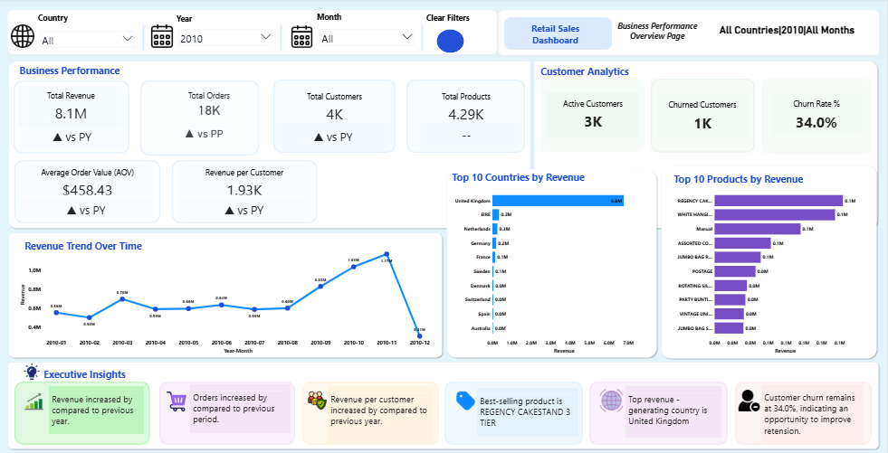
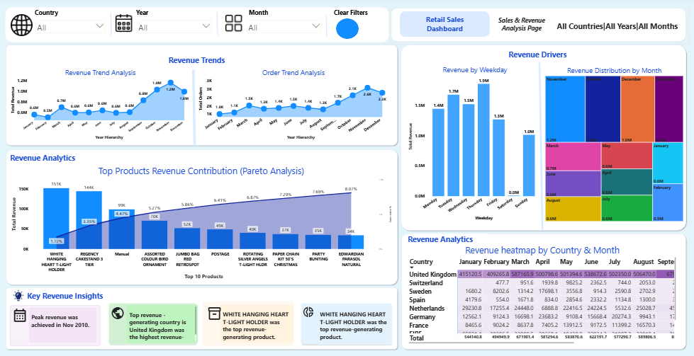
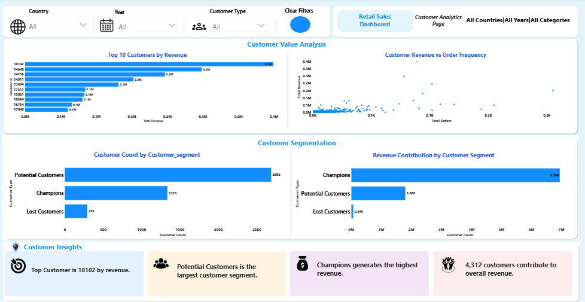

# 📊 Retail Sales and Customer Analytics Dashboard

### End-to-End Business Intelligence Solution using Python & Power BI

> **Transforming raw retail transaction data into actionable business insights through data cleaning, exploratory data analysis, customer segmentation, and interactive business intelligence reporting.**

<p align="left">


</p>

---

# 🎯 Executive Summary

This project presents an end-to-end Retail Sales Analytics solution developed using **Python** and **Power BI** to transform raw transactional data into meaningful business insights.

The solution follows a complete analytics workflow, beginning with **data quality assessment**, **data cleaning**, **feature engineering**, and **exploratory data analysis (EDA)** in Python, followed by **RFM customer segmentation**, **Power BI data modeling**, **DAX-based KPI development**, and interactive dashboard creation.

The final dashboard enables business stakeholders to monitor organizational performance, identify revenue drivers, evaluate customer behavior, analyze product performance, and support data-driven business decisions through an intuitive and interactive reporting experience.

---

# 🚀 Project Highlights

✔ End-to-End Retail Sales Analytics Solution

✔ Data Cleaning & Quality Assessment using Python

✔ Feature Engineering for Business-Oriented Metrics

✔ Exploratory Data Analysis (EDA) to Identify Revenue and Customer Trends

✔ RFM-Based Customer Segmentation for Customer Value Analysis

✔ Interactive Power BI Dashboard with Dynamic DAX Measures

✔ Business-Focused KPI Development and Performance Monitoring

✔ Actionable Insights and Strategic Business Recommendations

---
# 📊 Dashboard Preview

The Power BI solution is designed across three analytical pages, enabling business stakeholders to monitor organizational performance, analyze sales trends, and evaluate customer behavior through interactive and data-driven reporting.

---

## 📈 Business Performance Overview

Provides a high-level view of business performance through executive KPIs, revenue trends, product performance, country analysis, and year-over-year growth indicators.



### Key Business Insights

- Generated an overall revenue of approximately **8.8M** from retail transactions.
- **United Kingdom** emerged as the highest revenue-generating market.
- **November** recorded the highest monthly sales, highlighting seasonal demand.
- Identified the top-performing products contributing significantly to overall revenue.
- Monitored business performance using dynamic KPIs and Year-over-Year growth analysis.

---

## 💰 Sales & Revenue Analysis

Provides detailed analysis of sales performance across products, countries, and time periods using revenue trends, Pareto analysis, contribution analysis, and seasonal patterns.



### Key Business Insights

- Identified products contributing the highest share of total revenue.
- Pareto analysis highlighted that a small percentage of products generated the majority of sales.
- Revenue trends revealed clear seasonal purchasing patterns across different months.
- Country-level analysis helped identify high-performing and low-performing markets.
- Dynamic time intelligence enabled comparison of sales performance across different periods.

---

## 👥 Customer Analytics

Evaluates customer behavior through revenue contribution, order frequency, RFM segmentation, customer concentration, and value-based customer analysis.



### Key Business Insights

- Identified the **Top 10 customers** contributing the highest revenue.
- RFM analysis classified customers into actionable business segments such as **Champions**, **Potential Customers**, and **Lost Customers**.
- Champion customers contributed the highest share of overall revenue.
- Potential Customers represented the largest customer group, indicating strong opportunities for customer growth and retention.
- Customer concentration analysis helped identify the percentage of customers driving the majority of business revenue.
- 
---
# 📂 Dataset Overview

The analysis is based on the **Online Retail** transactional dataset containing customer purchase records from a UK-based online retail business. The dataset captures detailed sales transactions, enabling comprehensive analysis of revenue performance, customer purchasing behavior, and product-level trends.

### Dataset Characteristics

- **Domain:** Retail / E-Commerce
- **Granularity:** Transaction Level
- **Time Period:** December 2010 – December 2011
- **Primary Market:** United Kingdom (with transactions from multiple countries)

### Key Business Entities

| Entity | Description |
|---------|-------------|
| Invoice | Unique sales transaction identifier |
| Customer | Customer making the purchase |
| Product | Item purchased by the customer |
| Quantity | Number of units purchased |
| Unit Price | Selling price per product |
| Revenue | Calculated as Quantity × Unit Price |
| Invoice Date | Date and time of transaction |
| Country | Customer's country |

### Business Value of the Dataset

The dataset provides sufficient transactional detail to perform sales analysis, customer segmentation, product performance evaluation, geographic analysis, and business intelligence reporting through an end-to-end analytics workflow.

---
# 💼 Business Problem

Retail businesses generate thousands of sales transactions every day across products, customers, and geographic locations. While this transactional data contains valuable business information, it is often stored as raw records, making it difficult for decision-makers to extract meaningful insights.

The absence of a centralized analytical solution limits the ability to answer critical business questions, such as:

- How is the business performing overall?
- Which products generate the highest revenue?
- Which countries contribute most to sales?
- Who are the most valuable customers?
- Which customer segments should be targeted for retention and growth?
- What sales trends can support future business planning?

To address these challenges, this project develops an end-to-end analytics solution that transforms raw retail transaction data into interactive dashboards and actionable business insights, enabling stakeholders to make informed, data-driven decisions.

---
# 🎯 Business Objectives

The primary objective of this project was to develop an interactive Business Intelligence solution that enables stakeholders to monitor business performance and support strategic decision-making through data-driven insights.

The solution was designed to achieve the following objectives:

- Monitor overall business performance using executive-level KPIs.
- Identify high-performing products and major revenue contributors.
- Analyze sales performance across different countries and time periods.
- Understand customer purchasing behavior and buying patterns.
- Segment customers using RFM analysis to support targeted business strategies.
- Identify high-value customers and potential customer growth opportunities.
- Develop interactive dashboards for real-time business monitoring.
- Generate actionable insights to support revenue growth and customer retention initiatives.

---
# 🏗️ Solution Architecture

The project follows a structured end-to-end analytics workflow, beginning with raw transactional data and ending with interactive business intelligence dashboards that support data-driven decision-making.

```text
Raw Retail Sales Dataset
            │
            ▼
Data Quality Assessment
            │
            ▼
Data Cleaning & Transformation
(Python - Pandas)
            │
            ▼
Feature Engineering
            │
            ▼
Exploratory Data Analysis (EDA)
            │
            ▼
RFM Customer Segmentation
            │
            ▼
Power BI Data Modeling
            │
            ▼
DAX Measure Development
            │
            ▼
Interactive Dashboard Development
            │
            ▼
Business Insights & Recommendations
```
### Solution Flow

- **Raw Dataset:** Imported the retail transactional dataset into Python.
- **Data Cleaning:** Removed missing values, duplicate records, cancelled invoices, and invalid transactions.
- **Feature Engineering:** Created business metrics such as Revenue, Month, Year, RFM metrics, and Customer Segments.
- **EDA:** Analyzed sales trends, product performance, customer behavior, and country-wise revenue patterns.
- **Customer Segmentation:** Performed RFM analysis to classify customers into meaningful business segments.
- **Power BI Modeling:** Built a star-schema data model and established relationships between tables.
- **DAX Development:** Developed reusable business KPIs and dynamic measures for interactive reporting.
- **Dashboard Development:** Designed three analytical dashboard pages with interactive visuals, slicers, and drill-down capabilities.
- **Business Insights:** Generated actionable insights and recommendations to support business decision-making.

---
# 🧹 Data Cleaning & Feature Engineering

Before performing any analysis, the raw retail transaction dataset was cleaned and transformed to improve data quality and ensure reliable business insights.

## Data Cleaning

The following preprocessing steps were performed using **Python (Pandas)**:

- Removed duplicate transaction records.
- Removed records with missing Customer IDs.
- Excluded cancelled transactions (Invoice numbers starting with **"C"**).
- Removed records with negative or zero quantities.
- Removed records with negative or zero unit prices.
- Converted the Invoice Date column into a proper DateTime format.
- Verified and corrected data types for analytical processing.

## Feature Engineering

Additional business-oriented features were created to support analysis and dashboard development.

| Feature | Purpose |
|----------|---------|
| Revenue | Calculated as Quantity × Unit Price |
| Year | Enables Year-over-Year analysis |
| Month | Supports monthly sales trend analysis |
| Month Name | Improves dashboard readability |
| Customer Revenue | Measures revenue generated by each customer |
| Product Revenue | Measures revenue contribution of each product |
| Order Count | Tracks customer purchasing frequency |
| RFM Metrics | Supports customer segmentation using Recency, Frequency, and Monetary values |

## Outcome

The cleaned and transformed dataset provided a reliable foundation for exploratory data analysis, customer segmentation, DAX calculations, and interactive Power BI dashboard development.

---
# 📈 Exploratory Data Analysis (EDA)

Exploratory Data Analysis (EDA) was performed to understand sales patterns, customer purchasing behavior, and product performance before developing the Power BI dashboards.

The analysis focused on answering key business questions through descriptive statistics and data visualization.

## EDA Objectives

- Understand overall sales performance.
- Identify monthly and yearly sales trends.
- Determine top-performing products based on revenue.
- Analyze customer purchasing behavior.
- Evaluate country-wise sales contribution.
- Identify high-value customers.
- Understand revenue distribution across customers and products.
- Validate data quality before dashboard development.

## Key Analyses Performed

| Analysis | Business Purpose |
|----------|------------------|
| Revenue Trend Analysis | Identify sales growth and seasonal patterns |
| Monthly Sales Analysis | Understand monthly business performance |
| Product Performance Analysis | Identify top revenue-generating products |
| Customer Revenue Analysis | Identify high-value customers |
| Country-wise Revenue Analysis | Evaluate market performance across countries |
| Revenue Distribution Analysis | Understand contribution across customers and products |
| RFM Preparation Analysis | Prepare customer metrics for segmentation |

## Outcome

The exploratory analysis uncovered important business trends and validated the dataset, providing the foundation for customer segmentation, KPI development, and interactive dashboard reporting.

---
# 👥 Customer Segmentation (RFM Analysis)

To better understand customer purchasing behavior, **RFM (Recency, Frequency, Monetary)** analysis was performed to classify customers into meaningful business segments based on their purchasing patterns.

## RFM Dimensions

| Metric | Description | Business Purpose |
|---------|-------------|------------------|
| **Recency (R)** | Number of days since the customer's last purchase | Measures customer engagement |
| **Frequency (F)** | Total number of purchase transactions | Measures customer loyalty |
| **Monetary (M)** | Total revenue generated by the customer | Measures customer value |

## Customer Segments

Customers were classified into business-focused segments, including:

- 🏆 Champions
- ⭐ Loyal Customers
- 🌱 Potential Customers
- 💤 At Risk Customers
- ❌ Lost Customers

## Business Value

RFM segmentation enables businesses to:

- Identify high-value customers for loyalty programs.
- Recognize customers with strong growth potential.
- Detect inactive customers requiring re-engagement.
- Support targeted marketing campaigns.
- Improve customer retention and revenue growth strategies.

## Outcome

The generated customer segments were integrated into the Power BI dashboard, allowing stakeholders to compare customer distribution, revenue contribution, and customer value across different business segments.

---
# 📊 Power BI Dashboard Development

The final Business Intelligence solution was developed in **Power BI** to transform analytical findings into interactive dashboards that support business decision-making.

## Dashboard Features

The solution includes:

- Executive KPI Cards for business performance monitoring.
- Interactive slicers for dynamic data filtering.
- Drill-down analysis across different business dimensions.
- Dynamic DAX measures for real-time KPI calculations.
- Business-focused visualizations for sales, products, and customer analysis.
- Cross-filtering and interactive report navigation.

## Dashboard Pages

### 📈 Business Performance Overview

Focuses on executive-level KPIs including:

- Total Revenue
- Total Orders
- Total Customers
- Average Order Value
- Monthly Revenue Trend
- Country-wise Revenue Analysis
- Product Performance
- Year-over-Year Growth Analysis

---

### 💰 Sales & Revenue Analysis

Provides detailed sales performance through:

- Revenue Trend Analysis
- Top Product Analysis
- Revenue Contribution
- Pareto Analysis
- Product Performance Comparison
- Country-wise Sales Analysis

---

### 👥 Customer Analytics

Provides customer-focused business insights through:

- Top Customers by Revenue
- Revenue vs Orders Analysis
- Customer Revenue Distribution
- RFM Customer Segmentation
- Customer Revenue Contribution
- Customer Concentration (Pareto)
- Dynamic Business Insights

## DAX Measures Developed

Several reusable DAX measures were created to support dynamic reporting, including:

- Total Revenue
- Total Orders
- Total Customers
- Average Order Value
- Revenue Growth (YoY)
- Revenue Contribution (%)
- Customer Revenue Rank
- Cumulative Revenue
- Customer Segmentation Metrics
- Dynamic Insight Measures

## Outcome

The Power BI dashboard provides business stakeholders with an interactive platform to monitor performance, explore trends, identify opportunities, and make informed business decisions through self-service analytics.

---
# 💡 Key Business Insights

The analysis generated several valuable business insights that can support strategic decision-making.

- Overall business revenue exceeded **8.8M**, indicating strong sales performance during the analysis period.
- The **United Kingdom** contributed the highest share of total revenue, making it the primary revenue-generating market.
- **November** recorded the highest monthly sales, highlighting significant seasonal demand.
- A small percentage of products generated the majority of total revenue, confirming the **Pareto Principle (80/20 Rule)**.
- Revenue was highly concentrated among a limited number of high-value customers.
- **Champion Customers** contributed the largest share of customer revenue, while **Potential Customers** represented the largest customer segment with strong future growth opportunities.
- Customer segmentation enabled better understanding of customer behavior and helped identify opportunities for retention and targeted marketing.

# 📋 Business Recommendations

Based on the analysis, the following recommendations can help improve business performance:

- Focus retention strategies on Champion and Loyal Customers to maximize long-term revenue.
- Develop targeted marketing campaigns for Potential Customers to convert them into high-value customers.
- Re-engage At Risk and Lost Customers through personalized promotional offers.
- Maintain sufficient inventory for high-performing products during peak seasonal demand.
- Expand successful product offerings into high-performing markets.
- Continuously monitor business KPIs using interactive dashboards to support proactive decision-making.

  # 🛠️ Skills Demonstrated

## Business Intelligence

- Power BI Dashboard Development
- Interactive Dashboard Design
- KPI Development
- Business Storytelling

## Data Analytics

- Data Cleaning
- Data Transformation
- Feature Engineering
- Exploratory Data Analysis (EDA)
- Customer Segmentation (RFM)

## Data Modeling

- Star Schema Design
- Data Relationships
- Power Query Transformation

## DAX

- Calculated Measures
- Time Intelligence
- Ranking Functions
- Running Total Calculations
- Dynamic KPIs
- Revenue Contribution Analysis

## Python

- Pandas
- NumPy
- Data Manipulation
- Data Aggregation

## Business Analysis

- Sales Performance Analysis
- Customer Analytics
- Product Performance Analysis
- Revenue Trend Analysis
- Pareto Analysis

# 📂 Repository Structure

```text
Retail-Sales-Customer-Analytics-Dashboard
│
├── dashboard/
│   └── Retail Sales Customer Analytics Dashboard.pbix
│
├── notebooks/
│   └── Retail-Sales-Customer-Analytics.ipynb
│
├── screenshots/
│   ├── business_overview.png
│   ├── sales_revenue_analysis.png
│   └── customer_analytics.png
│
├── README.md
├── requirements.txt
├── .gitignore
└── LICENSE
```
# 🚀 Future Enhancements

Future improvements that can further enhance this solution include:

- Integration with live SQL databases.
- Automated data refresh using Power BI Service.
- Real-time dashboard monitoring.
- Customer churn prediction using Machine Learning.
- Sales forecasting using Time Series Analysis.
- Customer Lifetime Value (CLV) Analysis.
- Inventory optimization analytics.

# 👩‍💻 Author

**Aishwarya Kadapattimath**

Data Analyst | Python | Power BI | SQL | Business Intelligence

If you found this project helpful or interesting, feel free to connect and provide feedback.

⭐ If you like this project, don't forget to star the repository.
